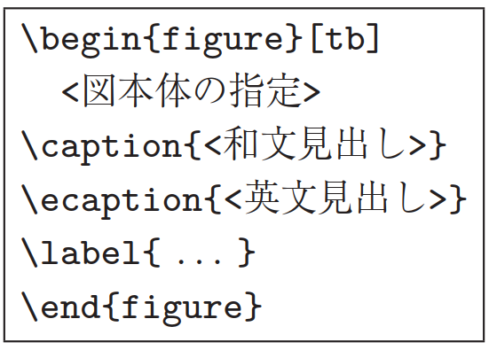

# はじめに

情報処理学会では，基幹論文誌として論文誌ジャーナルの発行を行っている．
これまで論文誌ジャーナル編集委員会では，
論文誌ジャーナルの論文掲載時のフォーマットとしてA4横型2段組を採用してきたが，
会員からの多くの要望に基づき，A4縦型2段組に変更することにした．
また，これまでは投稿時と掲載時の形式が異なっていたが，
今回のフォーマット変更に合わせて，
投稿時も掲載時と同様のA4縦型2段組で受け付けることにした．

これに伴い，\LaTeX のスタイルファイルも新しいものに変更した．
本稿では，まずそのスタイルファイルを用いた論文のフォーマットに関して述べる．
新たなスタイルファイルでは，極力特別なコマンドは使わずに，
標準的な \LaTeX のスタイルを踏襲している．
論文フォーマットに関しては，[@sec:format]章で後述する指針に従って頂くが，
そこに規定されていること以外は
標準的な \LaTeX のコマンドをそのまま使うことができる．
本稿は，そのスタイルファイルを実際に使っているので，論文執筆の際に参考にされたい[^paper-note]．

また，論文誌ジャーナル編集委員会では，
論文の執筆する際に，著者がするべきこと，するべきでないことを
「べからず集」としてまとめた．
本稿の後半に，論文の内容に関する指針になるように，
「べからず集」の内容をチェックリストとしてつけているので，
投稿する前の内容のチェックに利用されたい．

[^paper-note]: 本文は実際には論文誌ジャーナル編集委員会で作成したものである．

# 投稿の流れ

## 準備

情報処理学会論文誌ジャーナルの \LaTeX スタイルファイルを含む論文執筆キッ
トは

> <http://www.ipsj.or.jp/jip/submit/style.html>

\noindent
からダウンロードすることができる．
論文執筆キットは以下のファイルを含んでいる．

- `ipsj.cls` : 最終原稿用スタイルファイル
- `ipsjdraft.sty` : 投稿用スタイル（査読用）
- `ipsjpref.sty` : 序文用スタイル
- `jsample.tex` : 本稿のソースファイル
- `esample.tex` : 英文サンプルのソースファイル
- `ipsjsort.bst` : jBibTEX スタイル（著者名順）
- `ipsjunsrt.bst` : jBibTEX スタイル（出現順）
- `bibsample.bib` : 文献リストのサンプル
- `ebibsample.bib` : 英文文献リストのサンプル

キットはUnix用，Windows (DOS)用，Macintosh用などが用意されており，
著者の作業環境に応じたものを選択できるようになっている．
また，実行環境としては \LaTeXe を前提としているので，準備されたい．

## 最終原稿の作成と投稿

本稿に従って用意した投稿用原稿の \LaTeX ソースからpdfファイルを作成し，
Adobeのpdf readerで読めることを確認した後，

> [`https://www.ipsj.or.jp/prms/author_pre` `_submit.do`](https://www.ipsj.or.jp/prms/author_pre_submit.do)

\noindent
のPRMS (Paper Review Management System)にメールアドレスを登録し，
送られたきたメールに従って，指定されたURLから投稿する．
投稿の流れについては，

> [`http://www.ipsj.or.jp/journal/submit/manual/` `manual_j_for_Author.pdf`](http://www.ipsj.or.jp/journal/submit/manual/manual_j_for_Author.pdf)

\noindent
を参照されたい．

なお，情報処理学会論文誌ジャーナルでは，
論文の著者が査読者の名前を知ることがないだけなく，
査読者も著者の名前を知らないダブルブラインドの査読を取り入れている．
このため，投稿版では，原稿に著者名とその所属は表示しないようにする必要がある．

## 最終原稿の作成とファイルの送付

投稿した論文の採録が決定したら，
査読者からのコメントなどにしたがって原稿を修正し，
著者紹介など投稿時になかった項目があれば追加する．
また図表などのレイアウトも最終的なものとする．
なお後の校正の手間を最小にするために，
この段階で記述の誤りなどを完全に除去するように綿密にチェックして頂きたい．

最終版では，著者名およびその所属を表示すると同時に，
学会より指示された巻数，号数，先頭ページ番号，
受付／採録年月日（年は西暦）を記述する．
なお学会からの指示がない項目に関しては，記述しなくてよい．

学会へは**\LaTeX ファイル（をまとめたもの）とハードコピーの双方を**送付する．
送付するファイル群の標準的な構成は `.tex` と `.bbl` であり，
この他にPostScriptファイルや特別なスタイルファイルがあれば付加する．
なお `.tex` は印刷業者が修正することがあるので，必ず一つのファイルにする．
また必要なファイルが全てそろっていること，
特に特別なスタイルファイルに洩れがないことを，注意深く確認して頂きたい．

ファイルの送付方法などについては，
採録通知とともに学会事務局から送られる指示に従う．

## 著者校正・組版・出版

学会では用語や用字を一定の基準に従って修正することがある．
また \LaTeX の実行環境の差異などによって
著者が作成したハードコピーと実際の組版結果が微妙に異なることがある．
これらの修正や差異が問題ないかを最終的に確認するために，
著者にゲラ刷りが送られるので，
もし問題があれば朱書によって指摘して返送する．
なお**この段階での記述誤りの修正は原則として認められない**ので，
原稿送付時に細心の注意を払っていただきたい．

その後，著者の校正に基づき最終的な組版を行ない，オンライン出版する．

# 論文フォーマットの指針 {#sec:format}

以下，情報処理学会論文誌ジャーナル用スタイルファイルを用いた
論文フォーマットの指針について述べるので，
これに従って原稿を用意頂きたい．
\LaTeX を用いた一般的な文章作成技術については，
[@okumura;@companion] 等を参考にされたい．

# 論文の構成 {#sec:config}

ファイルは次のようになる．
下線部は投稿時に省略可能なもの．
またトランザクション特有コマンドについては[@sec:sig]節を参照されたい．

```
\documentclass[submit]{ipsj}
```

または[^draft]

```
\documentclass[submit,draft]{ipsj}
```

[^draft]: \[draft]は投稿用，スタイルオプションは[@sec:option]節参照．

必要ならばオプションのスタイルを追加

```
\setcounter{巻数}{<巻数>}
\setcounter{号数}{<号数>}
\setcounter{page}{<先頭ページ>}
\受付{<年>}{<月>}{<日>}
\採録{<年>}{<月>}{<日>}
```

必要ならばユーザのマクロをここに記述

```
\begin{document}
\title{表題(和文)}
\etitle{表題(英文)}
\affiliate{所属ラベル}{<和文所属>\\<英文所属>}
```

必要ならば `\paffiliate` により現在の所属を宣言する

```
\paffiliate{現所属ラベル}{<和現所属>\\<英現所属>}

\author{情報 太郎}{Taro Joho}
          {<所属ラベル>}[E-mail]
\author{処理 花子}{Hanako Shori}
          {<所属ラベル2,現所属ラベル3>}

\begin{abstract}
<概要（和文）>
\end{abstract}
\begin{jkeyword}
<キーワード>
\end{jkeyword}
\begin{eabstract}
<概要（英文）>
\end{eabstract}
\begin{ekeyword}
<KeyWords>
\end{ekeyword}
\maketitle
\section{第1節の表題}
...............
  <本文>
...............
```

謝辞がある場合は

```
\begin{acknowledgment}
\end{acknowledgment}

\begin{thebibliography}{99}%9 or 99
\bibitem{1}
\bibitem{2}
\end{thebibliography}
```

付録がある場合は

```
\appendix
\section{付録1節の表題}
\begin{biography}
\profile{<X>}{<苗字 名前>}{<プロフィール文章>}
\end{biography}
\end{document}
```

## オプション・スタイル {#sec:option}

`\documentclass{ipsj}`のオプション[^note-option]として，
以下のものを用意してある．
**何も定義しなければ和文論文用の標準スタイル**となるが，
今回，組版の際に和文論文のタイトル，和文論文種別に
「**太ミン**」「**太ゴ**」のフォントを使用しているため，
\TeX 標準フォントに置き換える `submit` というオプションを用意した．

[^note-option]: 研究会用のオプションは[@sec:sig]節で説明する．

- `submit` : フォント置換用
- `draft` : 投稿用
- `invited` : 招待論文
- `sigrecommended` : 推薦論文
- `technote` : テクニカルノート用
- `preface` : 序文用
- `JIP` : 英文用

これらのオプションは任意の組合せで使用が可能である．

`\documentclass[submit,draft]{ipsj}`とすれば，
投稿用のスタイルとなる．

なお，`\usepackage` で補助的なスタイルファイルを指定した場合には，
最終原稿用のファイル群に必ずスタイルファイルを含める．
ただし，\LaTeXe の標準配布に含まれているもの
（たとえば `graphicx`）については同封の必要はない．

スタイルファイルによっては論文誌スタイルと矛盾するようなものもあるので，
注意して使用して頂きたい．

## 表題・著者名等

表題，著者名とその所属，および概要を前述のコマンドや環境により
**和文と英文の双方について**定義した後，`\maketitle` によって出力する．

### 表題

表題は，`\title` および `\etitle` で定義した表題はセンタリングされる．
文字数の多いものについては，適宜 `\\` を挿入して改行する．

### 著者名・所属

各著者の所属を第一著者から順に `\affiliate` を用いて
ラベル（第1引数）を付けながら定義すると，
脚注に番号を付けて所属が出力される．
なお，複数の著者が同じ所属である場合には，一度定義するだけで良い．

現在の所属は `\paffiliate` を用い，同様にラベル，所属先を記述する．
所属先には自動で「現在」，`\\`の改行で「Presently with」が挿入される．
著者名は `\author` で定義する．
各著者名の直後に，英文著者名，所属ラベルとメールアドレスを記入する．
著者が複数の場合は `\author` を繰り返すことで，
2人，3人，... と増えていく．
現在の所属や，複数の所属先を追加する場合には，
所属ラベルをカンマで区切り，追加すればよい．

また，メールアドレス部分は省略が可能だが，
必ず代表者のアドレスは必要となる．
なお，和文著者名，英文著者名は，姓と名を半角（ASCII）の空白で区切る．

### 概要

和文の概要は `abstract` 環境の中に，
英文の概要は `eabstract` 環境の中に，それぞれ記述する．

### キーワード

和文の概要は `jkeyword` 環境の中に，
英文の概要は `ekeyword` 環境の中に，それぞれ1～5語記述する．

## 本文

### 見出し

節や小節の見出しには `\section`, `\subsection`, `\subsubsection`,
`\paragraph` といったコマンドを使用する．

「定義」，「定理」などについては，`\newtheorem`で適宜環境を宣言し，そ
の環境を用いて記述する．

### 行送り

2段組を採用しており，左右の段で行の基準線の位置が
一致することを原則としている．
また，節見出しなど，行の間隔を他よりたくさんとった方が読みやすい場所では，
この原則を守るようにスタイルファイルが自動的にスペースを挿入する．
したがって本文中では `\vspace` や `\vskip` を用いた
スペースの調整を行なわないようにすること．

### フォントサイズ

フォントサイズは，スタイルファイルによって自動的に設定されるため，
基本的には著者が自分でフォントサイズを変更する必要はない．

### 句読点

句点には全角の「．」，読点には全角の「，」を用いる．
ただし英文中や数式中で「.」や「,」を使う場合には，
半角文字を使う．「。」や「、」は使わない．

### 全角文字と半角文字

全角文字と半角文字の両方にある文字は次のように使い分ける．

1. 括弧は全角の「（」と「）」を用いる．
    但し，英文の概要，図表見出し，書誌データでは半角の「(」と「)」を用いる．
2. 英数字，空白，記号類は半角文字を用いる．
    ただし，句読点に関しては，前項で述べたような例外がある．
3. カタカナは全角文字を用いる．
4. 引用符では開きと閉じを区別する．
    開きには '"' を用い，閉じには '"' を用いる．

### 箇条書

箇条書に関する形式を特に定めていない．
場合に応じて標準的な `enumerate`, `itemize`, `description` の環境を用いてよい．


### 脚注

脚注は `\footnote` コマンドを使って書くと，
ページ単位に[^footnote-example]や[^footnote-example-2]のような
参照記号とともに脚注が生成される．
なお，ページ内に複数の脚注がある場合，
参照記号は \LaTeX を2回実行しないと正しくならないことに注意されたい．

[^footnote-example]: 脚注の例．
[^footnote-example-2]: 二つめの脚注．

また場合によっては，脚注をつけた位置と脚注本体とを別の段に置く方がよいこ
ともある．
この場合には，`\footnotemark` コマンドや
`\footnotetext` コマンドを使って対処していただきたい．

なお，脚注番号は論文内で通し番号で出力される．

### OverfullとUnderfull

組版時にはoverfullを起こさないことを原則としている．
従って，まず提出するソースが著者の環境でoverfullを起こさないように，
文章を工夫するなどの最善の努力を払っていただきたい．
但し，`flushleft` 環境，`\\`，`\linebreak` などによる
両端揃えをしない形でのoverfullの回避は，できるだけ避けていただきたい．
また著者の執筆時点では発生しないoverfullが，
組版時の環境では発生することもある．
このような事態をできるだけ回避するために，
文中の長い数式や `\verb` を避ける，
パラグラフの先頭付近では長い英単語を使用しない，
などの注意を払うようにして頂きたい．

## 数式 {#sec:Item}

### 本文中の数式

本文中の数式は `$` と `$`, `\(` と `\)`,
あるいは `math` 環境のいずれで囲んでもよい．

### 別組の数式

別組数式(displayed math)については `$$` と `$$` は使用せずに，
`\[` と `\]` で囲むか，`displaymath`, `equation`, `eqnarray` の
いずれかの環境を用いる．
これらは

$$
\Delta_l = \sum_{i=l|1}^L\delta_{pi}
$$

\noindent
のように，センタリングではなく固定字下げで数式を出力し，
かつ背が高い数式による行送りの乱れを吸収する機能がある．

### eqnarray環境

互いに関連する別組の数式が2行以上連続して現れる場合には，
単に`\[` と `\]`，あるいは `\begin{equation}` と`\end{equation}` で
囲った数式を書き並べるのではなく，
`\begin{eqnarray}` と `\end{eqnarray}` を使って，
等号（あるいは不等号）の位置で縦揃えを行なった方が読みやすい．

### 数式のフォント

\LaTeX が標準的にサポートしているもの以外の特殊な数式用フォントは，
できるだけ使わないようにされたい．
どうしても使用しなければならない場合には，
その旨申し出て頂くとともに，
組版工程に深く関与して頂くこともあることに留意されたい．

 {#fig:single height=0.1\\paperheight}

## 図

1段の幅におさまる図は， 図[@fig:single] の形式で指定する．
位置の指定に `h` は使わない．
また，図の下に和文と英文の双方の見出しを，
`\caption` と `\ecaption` で指定する．
文字数が多い見出しはは自動的に改行して
最大幅の行を基準にセンタリングするが，
見出しが2行になる場合には適宜 `\\` を挿入して改行したほうが
良い結果となることがしばしばある（図[@fig:single] の英文見出しを参照）．
図の参照は `\figref{<ラベル>}` を用いて行なう．

![表[@tbl:right]の中身](../assets/figure2.png "Contents of Table [@tbl:right].") {#fig:left}

| left | center | right |
| :--- | :----: | ----: |
| L1   |   C1   |    R1 |
| L2   |   C2   |    R2 |

Table: 図[@fig:left] で作成した表 "A table built by Fig. [@fig:left]" {#tbl:right}

 {#fig:double onecolumn,width=0.9\\paperwidth}

また紙面スペースの節約のために，
1つの `figure`（または `table`）環境の中に
複数の図表を並べて表示したい場合には，
図[@fig:left] と 表[@tbl:right] のように
個々の図表と各々の `\caption`/`\ecaption` を
`minipage` 環境に入れることで実現できる．
なお図と表が混在する場合，
`minipage` 環境の中で `\CaptionType{figure}` あるいは
`\CaptionType{table}` を指定すれば，
外側の環境が `figure` であっても `table` であっても
指定された見出しが得られる．

2段の幅にまたがる図は，図[@fig:double] の形式で指定する．
位置の指定は `t` しか使えない．

図の中身では本文と違い，
どのような大きさのフォントを使用しても構わない
（図[@fig:double] 参照）．
また図の中身として，encapsulate された
PostScriptファイル（いわゆるEPSファイル）を読み込むこともできる．
読み込みのためには，プリアンブルで

```
\usepackage{graphicx}
```

\noindent
を行った上で，`\includegraphics` コマンドを図を埋め込む箇所に置き，
その引数にファイル名（など）を指定する．

## 表

表の罫線はなるべく少なくするのが，仕上がりをすっきりさせるコツである．
罫線をつける場合には，一番上の罫線には二重線を使い，
左右の端には縦の罫線をつけない （表[@tbl:example]）．
表中のフォントサイズのデフォルトは `\footnotesize` である．

また，表の上に和文と英文の双方の見出しを，
`\caption`と `\ecaption` で指定する．
表の参照は `\tabref{<ラベル>}` を用いて行なう．

|      | column1  | column2  | column3  |
| :--- | :------- | :------- | -------- |
| row1 | item 1,1 | item 2,1 | ---      |
| row2 | ---      | item 2,2 | ---      |
| row3 | item 1,3 | item 2,3 | item 3,3 |
| row4 | item 1,4 | item 2,4 | item 3,4 |

Table: 表の例 "An Example of Table." {#tbl:example}

## 参考文献・謝辞

### 参考文献の参照

本文中で参考文献を参照する場合には `\cite` を使用する．
参照されたラベルは自動的にソートされ， `[]` でそれぞれ区切られる．

> 文献 `\cite{companion,okumura}` は \LaTeX の総合的な解説書である．

\noindent
と書くと

> 文献[@companion;@okumura]は \LaTeX の総合的な解説書である．

\noindent
が得られる．

### 参考文献リスト

参考文献リストには，
原則として本文中で引用した文献のみを列挙する．
順序は参照順あるいは第一著者の苗字のアルファベット順とする．
文献リストはBiB\TeX と `ipsjunsrt.bst`（参照順）
または `ipsjsort.bst` （アルファベット順）を用いて作り，
`\bibliograhpystyle` と `\bibliography` コマンドにより
利用することが出来る．
これらを用いれば，
規定の体裁にあったものができるので，
できるだけ利用していただきたい．
また製版用のファイル群には `.bib` ファイルではなく
`.bbl` ファイルを必ず含めることに注意されたい．
一方，何らかの理由でthebibliography環境で文献リストを
「手作り」しなければならない場合は，
このガイドの参考文献リストを注意深く見て，
そのスタイルにしたがっていただきたい．

### 謝辞

謝辞がある場合には，参考文献リストの直前に置き，
`acknowledgment`環境の中に入れる．
この環境の中身は投稿時には出力されない．

## 著者紹介

本文の最後（`\end{document}` の直前）に，以下のように著者紹介を記述する．

```
\begin{biography}
\profile{m}{<第一著者名>}{第一著者の紹介}
\profile{m}{<第二著者名>}{第二著者の紹介}
\profile{m}{<...>}{...}
\end{biography}
```

なお最初の引数を変えることで，会員種別が変わる．
学生会員の場合は`s`，
フェローの場合は`f`，
非会員の場合は`n`を入れる．

```
\profile{n}{<第一著者名>}{第一著者の紹介}
```

なお著者紹介は投稿時には出力されない．

# 論文内容に関する指針

論文の内容について，
論文誌ジャーナル編集委員会で作成した「べからず集」を以下に示す．
投稿前のチェックリストとして利用頂きたい．
これ以外にも，査読者用，メタ査読者用の
「べからず集」[@webpage2]も公開しているので，参照されたい．
また，作文技術に関する [@book1;@book2;@book3;@book4] のような書籍も参考になる．

## 書き方の基本

- 研究の新規性，有用性，信頼性が読者に伝わるように記述する．
- 読み手に，読みやすい文章を心がける（内容が前後する，背景・
    課題の設定が不明瞭などは読者にとって負担）．
- 解決すべき問題が汎用化（一般的に記述）されていないのは再考を要する
    （XX大学の問題という記述に終始）．
    あるいは，（単に「作りました」だけで）解決すべき問題そのものの
    記述がないのは再考を要する．
- 結論が明確に記されていない，または，範囲，限界，問題点などの
    指摘が適切ではない，または，結論が内容にそったものではないものは
    再考を要する．
- 科学技術論文として不適当な表現や，分かりにくい表現があるのは再考を要する．
- 極端な口語体や，長文の連続などは再考を要する．
- 章，節のたて方，全体の構成等が適切でない文章は再考を要する．
- 文中の文脈から推測しないと内容の把握が困難な論文にしない．
- 説明に飛躍した点があり，仮説等の説明が十分ではないのは再考を要する．
- 説明に冗長な点，逆に簡単すぎる点があるのは再考を要する．
- 未定義語を減らす．

## 新規性と有効性を明確に示す

- 在来研究との関連，研究の動機，ねらい等が明確に説明されていないのは再考を要する．
- 既知／公知の技術が何であって，何を新しいアイデアとして
    提案しているのかが書かれていないのは再考を要する．
- 十分な参考文献は新規性の主張に欠かせない．
- 提案内容の説明が，概念的または抽象的な水準に終始していて，
    読者が提案内容を理解できない
    （それだけで新規性が感じられないもの）のは再考を要する．
- 論文で提案した方法の有効性の主張がない，
    またはきわめて貧弱なのは再考を要する．

## 書き方に関する具体的な注意

- 和文標題が内容を適切に表現していないのは再考を要する．
- 英文標題が内容を適切に表現していない，または英語として
    適切でないのは再考を要する．
- アブストラクトが主旨を適切に表現していない，
    または英文が適切ではないのは再考を要する．
- 記号・略号等が周知のものでなく，または，用語が適切でなく，
    または，図・表の説明が適当ではないのは再考を要する．
- 個人的あるいは非常に小さなグループ／企業だけで
    通用するような用語が特別な説明もなしに多用されているのは再考を要する．
- 図表自体は十分に明確ではない，または誤りがあるのは再考を要する．
- 図表が鮮明ではないのは再考を要する．
- 図表が大きさ，縮尺の指定が適切でないのは再考を要する.

## 参考文献

- 参考文献は10件以上必要（分野によっては20件以上，30件以上という意見もある）.
- 十分な参考文献は新規性の主張に欠かせない．
- 適切な文献が引用されておらず，その数も適切ではないのは再考を要する．
- 日本人によるしかるべき論文を引用することで
    日本人研究コミュニティの発展につながる．
- 参考文献は自分のものばかりではだめ．

## 二重投稿

- 二重投稿はしてはならない ― ただし国際会議に採択された論文を
    著作権が問題にならないように投稿することは構わない．
- 他の論文とまったく同じ図表を引用の明示なしに利用することは禁止．
- 既発表の論文等との間に重複があるのは再考を要する．

## 他の人に読んでもらう

- 投稿経験が少ない人は，採録された経験の豊富な人に校正してもらう．
- 読者の立場から見て論理的な飛躍がないかに注意して記述する．

## その他

- 条件付採録後の修正で，採録条件以外を理由もなく修正することは禁止．
- ダブルブラインドなので査読者は選べない．
- 投稿前にチェックリストの各項目を満たしているか，必ず確認する．

# おわりに

本稿では，A4縦型2段組み用に変更したスタイルファイルを用いた
論文のフォーマット方法と，論文誌ジャーナル編集委員会がまとめた
「べからず集」に基づく論文の書き方を示した．
内容的にまだ不十分の部分が多いため，意見，要望等を

> [`editt@ipsj.or.jp`](mailto:editt@ipsj.or.jp)

\noindent
までお寄せ頂きたい．
