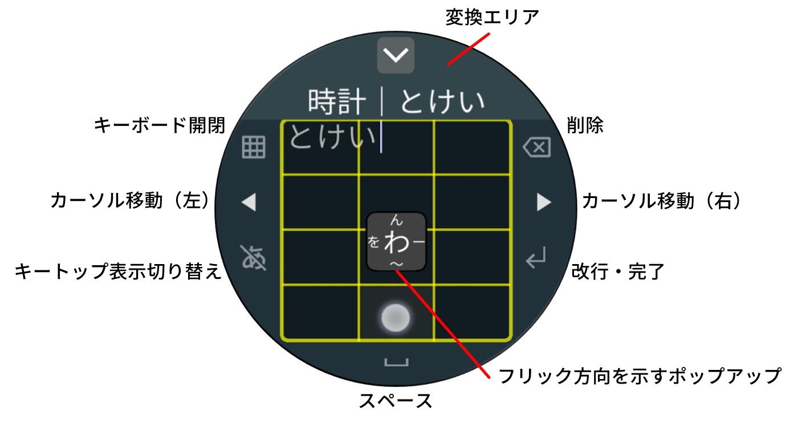
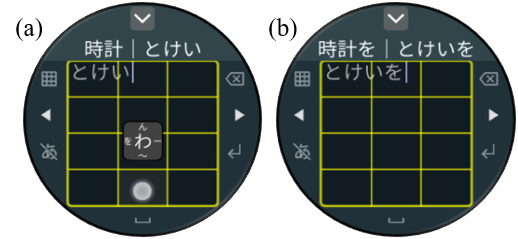

<!-- TODO

フォント変更
関連研究にWISSの自分の入れる
    # 関連研究
    我々は以前，スマートウォッチ向けのアイズフリー日本語
    入力手法を提案した [5]．
    本手法では，子音選択，母音選択

我々は以前，スマートウォッチ向けのアイズフリー日本語
入力手法を提案した [5]．
本手法では，子音選択，母音選択

自分メモ
	ウィルコクソン　http://www.m-sugaya.jp/python/python_signed_rank_test.cgi

付箋メモ
	議論
		速度やエラー率を超えた価値を考えてみるか
		スマートウォッチに縛られない持論
			音楽プレーヤ，Amazon Echo Spot，プリンタのタッチパネル
-->

# はじめに {#sec:intro}

今日，スマートウォッチのような小型タッチスクリーン端末（以降，小型端末）が多く普及している．
小型端末への文字入力には，主に音声入力や搭載されているタッチスクリーンでの入力によって行われる．
しかし，音声入力は同音異義語の識別や騒音下での認識率，プライバシーなどの面で問題がある．
また，ソフトウェアキーボードは，1つの平面上にテキストエリアや多くのキーを配置するため，
それらのサイズが小さくなっている（図[@fig:pair]a）．
それにより，指よりも小さいボタンを押し分けることが困難であるという
Fat Finger問題[@FatFinger]を引き起こしてしまう．
したがって，現在の小型端末の用途は情報提示が主であり，
文字入力性能を向上させることは大きな課題である．
実用的な文字入力手法が確立されれば，メッセージングアプリでの返信や文章によるメモ書きなど，
小型端末の利便性はさらに高まると考えられる．

{#fig:pair width=1.0\\linewidth}

日本語を入力する場合，
アルファベットの入力を対象としたキーボードにおけるローマ字入力を用いることができる．
しかし，ひらがな1文字を入力するための平均操作回数が多い上に，キーが小さく，
入力ミスが頻発するという問題がある．
そのため，一般的に図[@fig:flick]のような
テンキー配列のフリックキーボード（以降，フリックキーボード）が用いられる．
フリックキーボードでは，タップ位置で子音，フリック方向で母音を指定して文字入力を行う．
フリック操作により，キー押下を繰り返すトグル入力よりも軽負担で素早い操作を行うことができる．

{#fig:flick width=0.70\\linewidth}

そこで本稿では，フリック操作に基づく，キートップが透明な日本語入力キーボード
「InvisibleFlick」を提案する（図[@fig:pair]b）．
日本語入力手法として一般的なフリックキーボードと同様に，InvisibleFlickでは，
テンキー配列のキーボードにおけるフリック操作を採用した．
テキストエリアをテンキー部分の背景とし，テンキー部分のキートップを透明にすることで，
フリックキーボードとテキストエリアの2層のレイヤ構造を実現する．
これにより，キーとテキストエリアを同時に拡大することができるため，
文字入力速度の向上とエラー率の低減が期待できる．
InvisibleFlickの性能を評価するため，
一般的なフリックキーボードとの比較実験を行い，
文字入力速度，エラー率，および印象評価の分析を行った．

# 関連研究 {#sec:related}

InvisibleFlickは一部が透明なUI[^UI]を用いて，
小型端末における速く正確な文字入力を目指すものである．
本章では，透明・半透明なUIや小型端末における文字入力手法に関する研究を示す．

[^UI]: User Interface

## 透明・半透明なUI

クラゲ日本語入力[@kurage]では，
テンキー配列のフリックキーボードを半透明にすることで背景を視認可能にした．
Invisiboard[@Invisiboard]では画面を3 $\times$ 3の透明な領域に分割し，
タッチジェスチャと組み合わせることによって，アルファベットを入力する．
Zhuら[@TypingInvisible]はスマートフォンにおいて，
空間モデルを利用した透明なQWERTYキーボードを提案した．
ユーザがキーボードの配列を覚えていれば入力は可能であり，
少ない練習で通常のQWERTYキーボードに近い文字入力速度が出せることを示した．
Kimら[@design]はタブレット端末において，半透明なQWERTYキーボードのデザインが
パフォーマンスに与える影響を調査した．

## ソフトウェアキーボード

### アルファベットの入力

QWERTY配列を採用し，1文字を複数段階に分けて入力する手法が提案されている．
ZoomBoard[@ZoomBoard]はタップ操作でQWERTYキーボードを段階的に拡大する．
Swipeboard[@Swipeboard]はQWERTYキーボードのキーを9つのグループに分け，
スワイプによって段階的に決定する．

同様にQWERTY配列を採用しているが，1文字を1段階で入力する手法もある．
SplitBoard[@SplitBoard]はQWERTYキーボードを左右に分割し，スワイプによって切り替える．
FlickKey Mini Keyboard[@FlickKey]やFlit Keyboard[@Flit]では，
1つのキーに9個のアルファベットを割り当て，8方向にフリックすることでキーを押し分ける．
Flickey[@Flickey]は指が触れた周囲を拡大して，指の移動やフリックで文字を選択する．
DriftBoard[@DriftBoard]はキーをタッチするのではなく，
画面上の小さなキーボード自体を指で動かし，固定されたカーソルに合わせて入力する．
ForceBoard[@ForceBoard]では隣り合う2つのキーをタップの圧力で押し分ける．
DiaQwerty[@DiaQwerty]では様々な形状の画面に対応可能な，
アスペクト比が10:7のキーボードを提案した．
Leivaら[@ZShift]はタッチしている指の下に隠れているキーを拡大し，
ポップアップ表示する手法を提案した．

QWERTY配列を採用しているが，1単語を1段階で入力する手法もある．
WatchWriter[@WatchWriter]は縮小表示されたQWERTYキーボードの上でキーをなぞるジェスチャを行い，
統計モデルを利用して指の動きから英単語を推定する．
辞書に登録された単語の中から，ジェスチャによって入力された確率が最も高い単語を推定するため，
指の位置が正確でなくても単語を入力できる．

QWERTY以外の配列を採用した手法も提案されている．
SwipeKey[@SwipeKey]では，アルファベットを順に8つの領域に分け，スワイプの方向で押し分ける．
ETAO Keyboard[@ETAO]はアルファベットを順に3つの領域に分け，タップ操作で段階的に選択する．
初期画面にはよく使用される文字が表示されている．
1行で構成されたキーボードには，画面の周囲に配置した8つのキーを使う
TouchOne Keyboard[@TouchOne]やMinuum Keyboard[@Minuum]がある．
これらの手法では，1つのキーに3-4個のアルファベットを割り当てており，辞書を用いて単語を特定する．
辞書に載っていない単語は，1文字ずつ入力する必要がある．

### 日本語の入力

著者ら[@wiss]は，キートップが透明な日本語かな入力キーボードを提案した．
テンキー配列のフリックキーボードのキートップを透明にし，背景にテキストエリアを表示する．
本手法では，変換機能のためのUIを追加した．
Wear OS by Google[^wearos]を搭載する端末では，
テンキー配列のフリックキーボードであるGoogle日本語入力[@google]を使用できる（図[@fig:pair]a）．
テンキー上でタップ，もしくは上下左右の4方向にフリックを行うことで文字を入力できる．
テンキー配列以外の配列を採用した手法も提案されている．
秋田ら[@slideIn]はスライドイン（画面外から画面内に指を滑らせる動作）を使用し，
段階的に子音や母音を入力する手法を提案した．
BubbleSlide[@BubbleSlide]は子音キーから画面中央方向にスワイプし，
その長さによって母音を押し分ける．
HARIキーボード[@hari]は子音キーを押して指を画面中央部までスライドし，
母音キー上で離すことで入力を行う．
これらはいずれも画面周囲にキーを配置しているが，その位置や大きさには差がある．
ShuttleBoard[@ShuttleBoard]は10個の子音キーと5個の母音キーで構成され，
子音から母音へキーをなぞって入力する．指を離すことなく繰り返すことで連続して文字を入力できる．

[^wearos]: <https://wearos.google.com/>

## タッチ操作によるアイズフリー入力

画面を見ることなく（アイズフリー），
タッチによるジェスチャ操作によって文字入力を行う手法が提案されている．
下岡ら[@eyes]は，テンキー配列を採用し，2本指でフリックする方向によって
子音と母音を段階的に押し分けて入力する手法を提案した．
井川ら[@ikawa]は，テンキー配列を採用し，1本指でフリックする方向によって
子音と母音を段階的に押し分けて入力する手法を提案した．

アイズフリーの手書き入力に関しても提案がされている．
植野ら[@fuchi]は画面内を縁に沿ってなぞる操作によって文字を入力する手法を提案した．
金井ら[@kanai]は文字をストロークごとに分割して手書き入力する手法を提案した．

# InvisibleFlick {#sec:system}

{#fig:parts width=1.0\\linewidth}

InvisibleFlickは，テンキー部分のキートップが透明な日本語入力キーボードである．
日本語入力手法として一般的なフリックキーボードと同様に，
テンキー配列のキーボード上でのフリック操作により文字を入力する．
各部の名称と機能について，図[@fig:parts]に示す．
テキストエリアをテンキー部分の背景とし，
テンキー部分のキートップを透明[^keytop]にすることによって，
入力中のテキストを明瞭に視認することができる．
フリックキーボードとテキストエリアの2層のレイヤ構造の導入により，
キーとテキストエリアを同時に拡大することができるため，
文字入力速度の向上とエラー率の低減が期待できる．

[^keytop]: 境界線は半透明な線で描画

キートップが完全に透明であるため，半透明なキーボード[@kurage;@design]と比較して，
より明瞭にテキストを視認することができる．
また，既存のフリックキーボード（図[@fig:pair]a）では，
テキストエリアに表示できる文字数は全角で6文字（$6文字 \times 1行$）であるのに対し，
InvisibleFlickでは，文字サイズが同一の場合，
全角で49文字（$7文字 \times 7行$）表示することができる．

{#fig:basic width=1.0\\linewidth}

## ひらがなの入力とキー操作

ユーザはテンキー部分の上でフリック入力を行う．
テンキー部分のキー配置に関しては既存手法[@google]を参考に，一般的なものと同様にした．
各キーを押したとき，フリックする方向によって入力される文字をポップアップ表示する．
削除キーをタップすることで1文字削除，長押しで文字の連続削除を行う．
左右のカーソル移動キーでカーソルを移動し，入力位置を変更する．
テキストエリアをスクロールする場合は，キーボード開閉ボタンを押してキーボードを閉じ，
背景のテキストエリアを操作する．
キーボードが閉じた状態で文章をタップすると，タップした場所へカーソルが移動する．
改行・完了キーをタップすると，文章に改行を挿入し，長押しで入力を完了する．

## 変換機能 {#sec:convert}

日本語にはひらがなの他にカタカナや漢字などの多くの種類の文字が存在する．
それらに対応するため，日本語入力キーボードには変換機能が必須である．
Google日本語入力[@google]では，テキストエリアとキーボードの間の領域に
1行の変換候補選択領域（以降，変換エリア）を設けている（図[@fig:pair]a）．
変換候補が多くある場合に変換エリアの右端にある変換エリア拡大ボタンをタップすることで，
変換エリアを展開し，2行目以降を表示することができる．
変換する可能性が高い順に候補が左上から敷き詰められていくため，
1行表示状態の変換エリアを活用することで，より速く文字を変換することができる．

同様に，InvisibleFlickでも1行の変換エリアと，
拡大ボタンによる2行目以降の表示機能を実装した（図[@fig:convert]）．
変換候補の提示には，Google日本語変換CGI API[^google-api]を利用した．
変換を行うには，はじめに，ひらがなの入力を行う．
入力されるごとに，キーボード上部の1行の変換エリアに入力したひらがなに対する変換候補が表示される（図[@fig:convert]a）．
変換する候補が存在していれば，その候補をタップして確定する．
変換する候補が存在していなければ，最上部にある変換エリア拡大ボタンをタップすることで，
変換エリアを展開し，2行目以降を表示する（図[@fig:convert]b）．
そこで，変換したい候補をタップして確定する．

{#fig:convert width=1.0\\linewidth}

[^google-api]: <https://www.google.co.jp/ime/cgiapi.html>

## 段階的な透明化

InvisibleFlickでは，テンキー部分のキートップが透明であるため，
テンキー配列に慣れていないユーザがすぐに使いこなすことは難しいと予想される．
そのため，テンキー配列の学習を支援する方法として，
各キーを段階的に透明化させていくことができる（図[@fig:gradually]）．
はじめにキートップを半透明で表示しておき，キーごとの入力ミスの頻度に応じて，
完全な透明に近づけていく．
完全にキートップが透明になった場合でも，入力ミスの頻度が増えれば，
キートップの透明度が下がり，視認できる状態に戻る．
これにより，テンキー配列に慣れていないユーザも，使い続けていくことで徐々に配列を覚え，
キートップが透明でも入力ができるようになると期待できる．

{#fig:gradually width=1.0\\linewidth}

# 評価実験 {#sec:experiment}

InvisibleFlickの性能と操作性を検証するために，
既存手法であるフリックキーボードとの比較実験を実施した．
フリックキーボードとは，
スマートウォッチにおける日本語入力キーボードで一般的に用いられる手法である．
キートップが透明であることやキーサイズの拡大の影響を調べるため，
ひらがなのフレーズを入力するタスクを行った．
スマートフォン上にスマートウォッチを模したキーボードを実装し，これを実験に用いた．

## 参加者 {#sec:participant}

本実験では大学生・大学院生10名が参加した．
男性7名，女性3名で，年齢は22-24歳（平均年齢23.4歳）であった．
右利きが9名，左利きが1名で，全員が左腕に時計をつけると答えた．
スマートウォッチの使用経験者は4名であり，
スマートウォッチ上でのソフトウェアキーボードによる日本語入力経験者はいなかった．
また，全員がスマートフォンを使用しており，使用歴は6-12年で，
日本語入力を行う際に8名がテンキー配列のフリックキーボードを使用しており，
うち1名はトグル入力のみを使用していた．
テンキー配列のフリックキーボードを使用していない2名はQWERTY配列のキーボードを使用していた．

## 実験機器

{#fig:ex-hand width=1.0\\linewidth}

スマートフォンはLG社製Nexus5X（LG-H791，Android v8.1.0）を使用し，
ディスプレイ解像度は 1920 $\times$ 1080 pixels（115.3 mm $\times$ 64.9 mm, 423 ppi）であった．
実験システムとなるアプリケーションはProcessing[^processing] v3.3.4
（Processing for Android v3.0.1）によって実装した．
スマートフォンは，2本のマジックテープを用いて，
参加者の左腕に横向きに取り付けた（図[@fig:ex-hand]左）．

[^processing]: <https://processing.org/>

## 実験システム

図[@fig:ex-kizon]に示すように，
実験システムとしてスマートウォッチを模した円形の領域（以降，円形領域）内に，
既存手法とInvisibleFlickを実装した．
円形領域の直径は 356 pixel（35.6 mm）であり，
スマートウォッチの本体サイズ[^size]として一般的な42mmの端末に搭載されている
タッチスクリーンと同程度のサイズとした．
既存手法のレイアウトはWearOS向けに提供されている
Google日本語入力[@google]のフリックキーボードと同様にした．
円形領域のすぐ上にはひらがなの提示フレーズの表示領域があり，漢字表記もその上に表示した．

[^size]: 画面とベゼル（縁）を含むケース部分の幅

{#fig:ex-kizon width=1.0\\linewidth}

## フレーズ

提示する文字として，5-6文字のひらがなで構成されるフレーズを144個用意した．
6つのフレーズの入力を行うことを1セッションと定義し，24セッション分にフレーズを分ける．
濁音・半濁音・小文字の数，および合計文字数は，各セッションで統一した．
1人の実験参加者に対して各フレーズは一度しか提示しない．

## タスク

参加者は画面上部に表示される提示フレーズを入力する．
このとき，入力された文字が提示フレーズと完全一致するまで修正を行う．
一致すると，自動で次のフレーズが表示される．
参加者はこれを繰り返す．

## 手順 {#sec:procedure}

実験は静かな室内で行われた．
疲労や慣れによる手法ごとに偏りが出るのを防ぐため，
参加者を2つのグループに分け，使用する入力手法の順番を変更した．

まず，参加者は実験の目的および内容，タスクの説明を受けた．
その後，ノギスを用いて左手の人差し指の幅[^finger]を測定した．
平均サイズは14.9mm（$SD$=1.4mm）であり，日本人の標準的なサイズの範囲内であった[@hand]．
測定後，参加者はマジックテープを用いてスマートフォンを左手に装着したのち，
フリック入力と2手法すべての入力方法の説明を約10分間受けた．
このとき，テンキー配列表（フリックの方向と文字の対応も記してある）を用いた．

[^finger]: 指を伸ばした状態での，指の遠位指関節間関節の最大幅

次に，文字入力手法の1つ目で5分間練習を行った．
入力する文字は自由であり，テンキー配列表を確認することができた．
また，腕の疲労を抑えるため，練習中は腕を机などに乗せることを許可した．
1分間休憩した後，練習した手法での入力を12セッション行った．
このとき，テンキー配列表を確認すること，腕を机などに乗せることは禁止した．
また，最終セッションをのぞき，3セッションごとに1分間休憩した．

3分間休憩した後，文字入力手法の手法2つ目についても，1つ目と同様に行った．
最後にアンケートへの回答を行った．
内容はスマートフォンの使用歴等に関する質問，
各手法についての印象に関する5段階評価および，
各手法についての感想（自由記述）の3つであった．

参加者はすべての実験を通して144フレーズ入力することになる
（6フレーズ $\times$ 12セッション $\times$ 2手法）．
各手法における操作時間は20-30分程度であり，実験全体でかかった時間は60-90分程度であった．

入力の際には，できる限り正確に，かつ速く入力するように指示した．
参加者は両腕を空中に浮かせた状態で入力を行う（図[@fig:ex-hand]右）．
参加者は自身の疲労度合いにより，休憩時間を短縮することができた．

## 評価指標

文字入力速度の評価指標としてCPM（Character Per Minute）を用いる．
CPMは1分あたりの文字入力速度を表す．
CPM は式[@eq:cpm]より求める．
「入力にかかった時間」は， フレーズが提示された後，
はじめてタッチしたタイミングから，
入力文字が提示フレーズと完全に一致したタイミングまでの時間である．

$$
\mathrm{CPM} = \frac{提示フレーズの文字数}{入力にかかった時間 [分]}
$$ {#eq:cpm}

また，修正済みエラー率（Corrected error rate, Cerr）[@Cerr]についても測定する．
Cerr はすべての入力に対する誤入力を修正した割合\[%\]を表す．
Cerr は式[@eq:cerr]より求める．

$$
\mathrm{Cerr} = \frac{修正した文字数}{入力した文字数} \times 100
$$ {#eq:cerr}

# 結果・考察 {#sec:result}

## 文字入力速度

各手法の各セッションにおける平均文字入力速度を図[@fig:result-cpm]に示す．
全セッションにおいて，InvisibleFlickは既存手法より高い文字入力速度を示した．
全セッションを通した平均文字入力速度は，既存手法が111.0CPM，InvisibleFlickが147.6CPMとなった．
最終セッションにおける平均文字入力速度は，既存手法が109.3CPM，InvisibleFlickが163.7CPMとなった．
全セッションを通した平均文字入力速度について，対応のあるt検定を行った結果，
有意な差がみられた（$t_{9} = -3.41,\ p < .01$）．

{#fig:result-cpm width=1.0\\linewidth}

上記の結果より，InvisibleFlickは既存手法より速く文字を入力することができるといえる．
InvisibleFlickは既存手法と比較して，キーサイズが大きく，
キーに狙いを定めるまでの時間が短くなり，
操作時間が短くなったためであると考えられる．

## エラー率

各手法の各セッションにおける平均修正済みエラー率（Cerr）を図[@fig:result-cerr]に示す．
全セッションにおいて，InvisibleFlickは既存手法より低いCerrを示した．
全セッションを通した平均Cerrは，既存手法が11.7%，InvisibleFlickが7.21%となった．
最終セッションにおける平均Cerrは，既存手法が12.2%，InvisibleFlickが5.64%となった．
最終セッションのCerrは第1セッションと比較して，
既存手法は約2.1ポイントの減少，InvisibleFlickは約3.2ポイントの減少が見られる．
全セッションを通した平均Cerrについて，対応のあるt検定を行った結果，
有意な差がみられた（$t_{9} = 2.47,\ p < .05$）．

{#fig:result-cerr width=1.0\\linewidth}

上記の結果より，InvisibleFlickは既存手法より入力ミスが少ないといえる．
InvisibleFlickは既存手法と比較して，キーサイズが大きく，
ミスタップが減ったためであると考えられる．

## 印象評価

[@sec:procedure]節のおいて述べたように，
参加者に対し，各手法についての印象をリッカート尺度による5段階評価を行った．
印象に関する質問項目は以下の3つである．

- 使いやすかったか
- 今後も使用したいか
- 慣れやすかったか（慣れるまでの時間が短かったか）

上記の項目に対し，1: 全く同意できない / 2: 同意できない / 3: どちらともいえない / 4: 同意できる / 5: 非常に同意できる の5段階で評価を行った．
各手法に関する3つの質問項目に対し，印象を5段階評価した結果を図[@fig:ex-five]に示す
（**: $p < .01$, *: $p < .05$, n.s.: 非有意）．
各項目について，ウィルコクソンの符号順位検定を行った結果，
「使いやすかったか」・「今後も使用したいか」について，
有意な差がみられた（$t_{9} = 2.5,\ p < .05$，$t_{10} = 0.0,\ p < .01$）．
また，「慣れやすかったか」については，
有意な差は認められなかった．

よって，InvisibleFlickは既存手法と比較して，使いやすく，
今後も使用したいと感じる文字入力手法であるといえる．
一方で，慣れやすさについては，各手法間での印象に差はないといえる．

{#fig:ex-five width=1.0\\linewidth}

# 議論 {#sec:discussion}

## 熟達者が使用した場合の性能

今回の実験では，熟達者が使用した場合の性能については示せていない．
そこで，InvisibleFlickを30日間使用した著者1人を対象として，
[@sec:experiment]章の実験における入力タスクを行った．
なお，著者はスマートフォンの使用歴が7年（フリック入力を使用），
スマートウォッチの使用歴が2年（フリック入力を使用）である．
結果，全12セッションを通して，
文字入力速度は平均195.9CPMであり，修正済みエラー率は平均0.794%であった．
[@sec:experiment]章の実験での最終セッションにおける結果
（平均文字入力速度163.7CPM，修正済みエラー率5.64%）と比較すると，
より速く正確に入力ができている．
これは，キー配置が正確に記憶できており，
キーの押し間違いによる入力ミスが減ったことによって，修正時間が短縮されたためである．
このことから，InvisibleFlickを長期的に使用することによって，
文字入力速度は向上し，エラー率は低減すると考えられる．

## テキストエリアの操作方法

現状，背景のテキストエリアを操作するには，テンキー部分を非表示にする必要がある．
しかし，キーボードを表示したまま操作できれば，より速い入力が可能となる．
Guptaら[@Porous]は各指を識別することによって，
重なった半透明なUIレイヤーを別々に操作するインタフェースを提案している．
しかし，この手法ではセンサを指に装着する必要がある．
テンキー部分を非表示にせずにテキストエリアを操作には，
ダイヤル（竜頭）や
Apple Watch[^apple-watch]のような圧力検知可能なタッチスクリーンを用いる方法が考えられる．
これらの方法は，内蔵ハードを用いて操作を拡張でき，タッチ操作と併用できるという利点がある．
その他にも，テンキー部分の外からのスライドイン操作や，
2本の指でマルチタッチジェスチャを用いる方法も考えられる．
これらの方法は，すべての操作がタッチで完結するという利点がある．

[^apple-watch]: <https://www.apple.com/apple-watch-series-4/>

## 手首をひねることによる負担

小型端末におけるソフトウェアキーボードによる文字入力の際，手首には負担がかかる．
これはタッチ操作の際に，画面が見える顔側に手首をひねる必要があるためである．
この問題は，画面自体を即座に見える位置に移動することで解決できる．
例えば，SHIFT[^shift]のような，
画面を手の甲の親指側の位置で止めることができる小型端末向けバンドを用いることが考えられる．
これによって腕をひねる必要がなくなり，腕の負担を軽減できる．

[^shift]: <https://www.getedgegear.com/>

# まとめ {#sec:conclusion}

本稿では，小型端末で日本語入力を行う際に，
現状のソフトウェアキーボードの問題点であるテキストエリアやキーの小ささを克服するため，
キートップが透明な日本語入力キーボード「InvisibleFlick」を提案した．
その後，プロトタイプを作成し，既存手法との比較実験を行った．
結果，InvisibleFlickの使用を開始してから20-30分後の，
最終セッションにおける文字入力速度は平均163.7CPMに達し，
InvisibleFlickは文字入力速度・エラー率ともに既存手法より優れていることが示された．
また，印象に関する5段階評価では，使いやすく，今後も使用したいと感じるキーボードであると示された．
